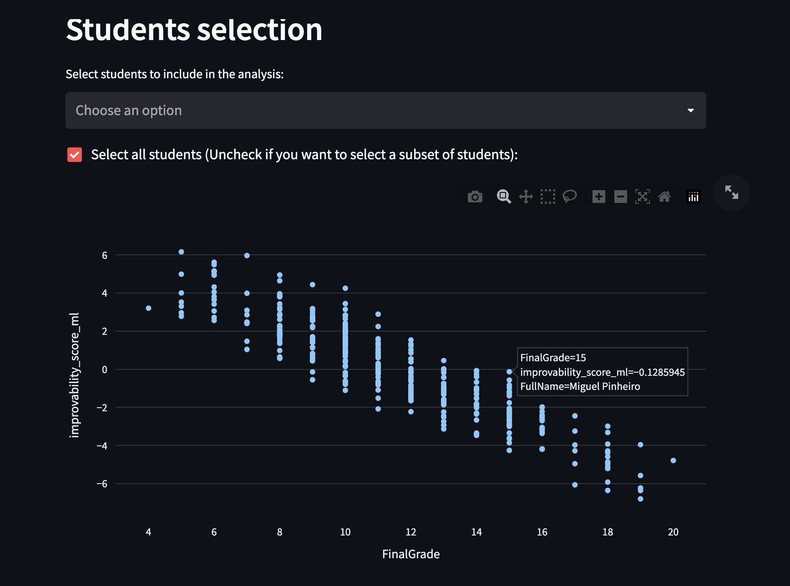
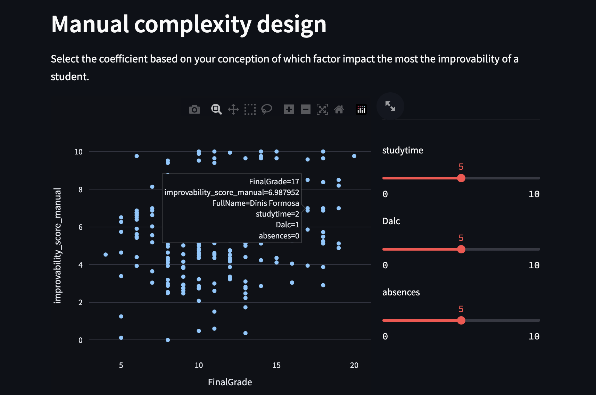

# Test technique Ekinox

## Installation et lancement

Le dashboard peut être lancé via un conteneur Docker via la commande ci-dessous:

```bash
chmod +x run.sh
./run.sh
```
Le dashboard est accessible via le navigateur web via l'adresse `http://0.0.0.0:8051/`.

Ce dashboard propose deux graphiques permettant de visualiser pour chaque élève sa note finale et son score "d'améliorabilité". Le premier graphique utilise un score généré par un modèle de machine learning. Le second utilise un score basé sur 3 caractéristiques des étudiants pondérés par des coefficients choisis par l'utilisateur.

L'utilisateur peut intéragir avec le dashboard en uploadant un nouveau dataset, en sélectionnant une école, en sélectionnant un subset d'étudiant ou en configurant les poids des trois caractéristiques, influant sur le score présenté dans la seconde visualisation. 


## Problématique et méthode

L'objectif est de proposer un outil d'aide à la décision à destination d'enseignants leur permettant de prioriser les élèves à accompagner. A partir d'un dataset contenant certaines informations sur les élèves, et notamment sur leur vie privée, l'objectif est de proposer un dashboard qui permettrait de prioriser les élèves à accompagner en fonction de la complexité et de la valeur d’un tel accompagnement. 

Ce dashboard pourrait par exemple se centrer autour d’un graphe permettant de visualiser l’ensemble des élèves de l’établissement suivant deux axes. Le premier axe présenterait la note actuelle de l’élève, indiquant ainsi l’intérêt qu’il y aurait à lui apporter un soutien personnalisé. Le deuxième axe permettrait d’évaluer la complexité d’accompagner l’élève pour améliorer son niveau scolaire (en se basant par exemple sur la présence d’indicateurs actionnables tels qu’un niveau d’absentéisme fort, la consommation d’alcool ou un temps d’étude hebdomadaire en dessous de la moyenne).


La complexité de ce problème vient principalement de l'ambiguité du concept de capacité d'amélioration d'un élève via un accompagnement. L'hypothèse prise dès le départ est que l'accompagnement ne peut pas influer sur les caractéristiques des étudiants présentes dans le jeu de données. Par exemple, on considère que l'accompagnement ne peut pas avoir d'impact sur le taux d'absenteisme. Dans le cas contraire, si cette accompagnement pouvait réduire l'absentéisme (via des réunions parent-prof par exemple), alors un élève très absent aurait potentiellement une bonne capacité d'amélioration via cet accompagnement. Mais dans ce travail, le choix a été fait de ne pas considérer cette option.

Deux propositions sont faites pour estimer un score d'améliorabilité.

### Proposition 1: Score manuel

C'est aux enseignants eux-même de faire ce score en leur permettant de paramétrer chaque facteur considérés dans le calcul du score. Ainsi, dans un premier temps, nous proposons comme score une somme pondéré de 3 facteurs : l'absentéisme, la consommation d'alcool et le temps hebdomaire passé à étudier. La pondération est effectuée par l'utilisateur du dashboard en fonction de la vision qu'il a sur l'influence de chaque facteur.


### Proposition 2: Score automatisé avec un modèle de machine learning

On pose l'hypothèse que l'améliorabilité d'un élève consiste en l'écart de note qu'il existe entre lui et la moyenne de la sous-population d'élèves possédant des caractéristiques similaire à lui. L'hypothèse consiste à considèrer que si les élèves avec un profil similaire ont en moyenne de meilleures notes que lui, alors un accompagnement permettrait probablement à l’élève de s'améliorer au moins à la hauteur de ses camarades. 

Autrement dit, les caractéristiques de l'étudiant conditionnent une distribution de note que pourrait avoir l’élève. L'objectif est d'abord d'estimer la moyenne de la distribution de note des élèves similaire à l'élève de référence pour ensuite calculer l'écart entre cette moyenne et la note de l'élève. 

Pour estimer cette distribution, l'idée est de la modéliser en fonction des différentes caractéristiques. Pour se faire, un modèle de machine learning (Gradient Boosting) a été entrainé à partir du dataset fourni. 

Ce projet contient aussi le script d'entrainement du modèle ainsi qu'un notebook jupyter ayant servi à l'exploration des données, à la sélection de feature ainsi qu'aux tests du modèle de machine learning. Pour les éxécuter, une option est d'utiliser conda:

```bash
conda create --file requirements.txt --name ekinox_test
conda activate ekinox_test
```

Pour le notebook:
```bash
jupyter notebook
```

Pour le script d'entrainement

```bash
python train.py
```
